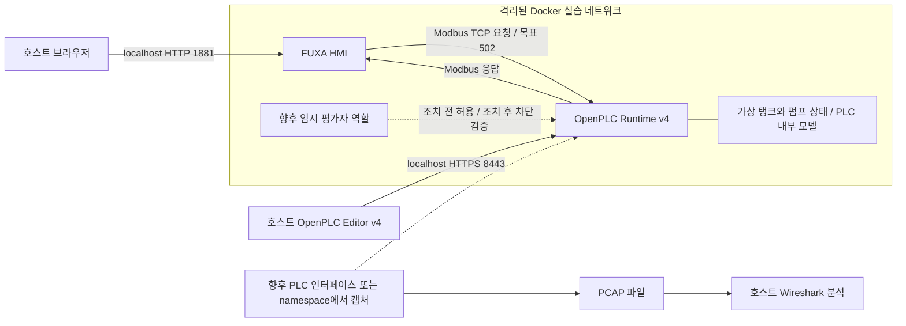

# Architecture v0.1

프로젝트: ICS Security Assessment Lab — Modbus TCP Security Assessment & Remediation

상태: 2026-09-14 Day 1 설계. 아래 포트·태그·주기는 설계값이며 동작 확인 결과가 아니다.

## 구성과 역할



도식은 개념도다. 같은 bridge 네트워크를 사용하면서 선만 나눈다고 보안 영역이 분리되는 것은 아니다. Purdue 모델의 HMI/제어 역할을 설명하는 축소 환경이며 표준 준수 또는 실제 제조망을 재현했다는 주장은 하지 않는다.

| 구성요소 | 역할 | 저장·관리 대상 |
| --- | --- | --- |
| OpenPLC Runtime v4 | IEC 61131-3 프로그램을 실행하는 소프트웨어 PLC | 제어 원본, runtime 설정 및 상태 보존 경로 |
| OpenPLC Editor v4 | 제어 프로그램 작성·배포용 엔지니어링 도구 | Editor 버전, 프로젝트 원본 |
| FUXA | 값을 읽어 표시하고 제한된 운전 명령을 보내는 HMI | 프로젝트 export, tag 설정, 필요한 영속 데이터 |
| Docker Compose | 두 서비스의 실행·네트워크·저장소 정의 | 향후 자체 작성할 설정과 이미지 식별자 |
| Wireshark | 저장된 패킷에서 요청과 응답을 해석 | PCAP, 화면, 패킷 번호와 해석 |
| 평가자 | 후속 진단에서 일반 HMI와 다른 출발점을 표현 | 임시 접근 경로, 허용 대상, 검증 기록 |

OpenPLC의 v4 관리면은 HTTPS 8443이며 예전 v3 방식의 웹 관리 화면이 아니다. Modbus 서버 plugin의 활성화와 주소 mapping은 선택 버전에서 별도로 확인해야 한다. 관리 API가 준비됐다는 사실만으로 Modbus가 준비됐다고 볼 수 없다. [OpenPLC 공식 설명](https://github.com/Autonomy-Logic/openplc-runtime)

## 통신과 경계

| 출발 → 도착 | 목적 | 설계 정책 |
| --- | --- | --- |
| 호스트 브라우저 → FUXA | 화면·설정 | 호스트 loopback에만 1881 게시 |
| 호스트 Editor → PLC 관리면 | 프로그램 배포·상태 확인 | 호스트 loopback에만 8443 게시 |
| FUXA backend → PLC | 주기적 Modbus 조회 및 운전 명령 | 실습 내부 TCP 502 목표, 서비스 이름으로 연결 |
| 평가자 → PLC | 향후 통제된 비교 검증 | 외부망에서 진입 불가. 실습 안에서만 조치 전/후 비교 |
| 외부 LAN/인터넷 → 실습 | 업무상 필요 없음 | 서비스 게시 금지 |

브라우저가 Modbus를 보내는 것이 아니라 FUXA backend가 client이고 PLC가 server다. 컨테이너 내부 localhost는 해당 컨테이너 자신이므로 PLC 주소로 사용하지 않는다. Docker 서비스 이름과 관찰 당시 IP를 함께 기록한다. [Compose networking](https://docs.docker.com/compose/how-tos/networking/)

향후 네트워크는 외부 통신을 제한하는 internal 네트워크를 고려하고 Modbus 포트를 호스트에 게시하지 않는다. loopback 게시의 실제 동작과 외부 차단은 사용 환경에서 확인해야 한다. Docker 호스트 관리자는 신뢰 경계 안에 있으며 컨테이너 격리를 호스트 관리자에 대한 보안 통제로 주장하지 않는다. [Compose networks](https://docs.docker.com/reference/compose-file/networks/)

조치 전에는 실습 내부의 평가자가 PLC에 접근할 수 있는 상태를 비교 대상으로 삼는다. 조치 후에는 HMI→PLC는 유지하고 평가자→PLC는 차단한다. 단순화를 위해 평가자를 제어망에서 분리하고 공통 네트워크·게시 포트·우회 경로를 제거하는 네트워크 구성 변경을 우선 검토한다. 이는 기능 코드별 제어가 아니며 HMI가 침해된 경우의 Modbus 쓰기까지 해결하지 못한다. 규칙이나 Compose 구성은 이번에 작성하지 않는다.

## 최소 공정과 태그 계약

독자 설계: 물리 설비 없이 탱크 수위를 숫자로 표현한다. 펌프 가동 시 증가하고 정지 시 감소하는 단순 모델을 사용한다. 실제 유체역학·PLC 실시간 성능·안전계장시스템(SIS)을 재현하지 않는다.

| 논리 태그 | 의미 | 표현/범위 | HMI 권한 |
| --- | --- | --- | --- |
| tank_level | 가상 수위 | 정수 0–100 % | 읽기 |
| pump_command | 운전 요청 | Boolean | 정상 조작 시 쓰기 |
| pump_running | PLC가 결정한 실제 가상 상태 | Boolean | 읽기 |
| high_level_alarm | 수위 80% 이상 경보 | Boolean | 읽기 |

초기 수위 50%, 펌프 정지, 모델 갱신 1초, HMI polling 1초를 시작값으로 제안한다. 80% 이상에서는 PLC 로직이 펌프를 정지시키도록 설계한다. 명령 값과 실제 상태를 구별해 HMI 명령이 곧 물리 출력은 아니라는 점을 보여 준다. 한 화면에 수위, 펌프 상태, 경보, 운전 요청만 표시한다.

레지스터 주소와 OpenPLC 변수 binding은 **TBD**다. 각 태그마다 영역(Coils/Input Registers/Holding Registers 등), wire offset, 화면 주소 표기, 자료형, 읽기/쓰기 권한, 대응 변수를 후속 구축 때 확정한다. 40001 같은 표기와 패킷의 0-based offset을 혼동하지 않는다. 16-bit 값 위주로 시작해 32-bit word order 문제를 피한다. HMI에서 읽기 전용으로 표시하는 것과 서버가 쓰기를 거부하는 것은 다른 통제다. [Modbus 규격](https://www.modbus.org/modbus-specifications)

## 패킷 관찰 설계

호스트 Wi-Fi/Ethernet 캡처만으로 Docker 내부 통신이 보인다고 가정하지 않는다. 향후 PLC 네트워크 namespace 또는 트래픽이 실제 흐르는 Linux bridge에서 PCAP을 확보하고 호스트 Wireshark에서 읽는 방식을 우선한다. 일반 모니터링 컨테이너를 같은 네트워크에 연결하는 것만으로 모든 unicast가 보이지는 않는다. Windows Docker Desktop/WSL2 여부에 따라 캡처 경로를 확정한다.

확인할 항목은 IP/포트, Transaction ID, Unit ID, Function Code, 주소, 수량, 값, 응답 시간, Exception이다. `mbtcp`와 `modbus`는 Wireshark 표시 필터이며 캡처 필터와 다르다. [MBTCP 필드](https://www.wireshark.org/docs/dfref/m/mbtcp.html), [Modbus 필드](https://www.wireshark.org/docs/dfref/m/modbus.html)

## 재현성과 미확정 항목

- 실행 환경: Windows 호스트가 확인됐으나 Docker/WSL2 설치, 메모리·CPU 여유는 확인하지 않았다.
- 버전: OpenPLC v4 계열을 선택했지만 Editor/runtime의 정확한 호환 버전과 이미지 digest는 미정이다. FUXA도 검증 후 정확한 버전을 고정한다. latest를 최종 재현 기준으로 남기지 않는다.
- 소스 전체와 외부 설정을 복제하지 않는다. 후속 구현은 프로젝트에 필요한 최소 설정을 직접 작성한다.
- 재현 기록에는 OS, Docker Engine/Compose, 이미지 tag/digest, Editor 버전, PLC 원본, FUXA export, 초기값, 복원 순서를 포함한다.
- Compose 시작 순서는 서비스 준비 완료를 보장하지 않는다. 후속 확인은 컨테이너 실행→PLC 프로그램 실행→Modbus 응답→HMI 값 갱신 순으로 구분한다. [Compose startup order](https://docs.docker.com/compose/how-tos/startup-order/)
- 상태 보존은 FUXA 프로젝트와 PLC 프로그램을 재시작 후 되살릴 수 있는지로 검증한다. 정확한 volume 경로는 선택 이미지 문서와 맞춘다.
- privileged 모드나 host 네트워크를 기본값으로 채택하지 않는다. 필요한 권한은 선택 runtime의 공식 요구사항과 실제 실패 원인을 보고 후속 결정한다.

## 디렉터리 골격

```text
ics-security-assessment-lab/
├── docs/
│   ├── project-scope.md
│   ├── architecture.md
│   └── methodology.md
├── references/
│   └── sources.md
├── lab/
│   ├── compose/.gitkeep
│   ├── plc/.gitkeep
│   └── hmi/.gitkeep
├── evidence/
│   ├── baseline/.gitkeep
│   ├── assessment/.gitkeep
│   ├── remediation/.gitkeep
│   └── retest/.gitkeep
└── reports/.gitkeep
```

`.gitkeep`은 빈 폴더를 추후 Git으로 보존하기 위한 빈 파일이다. 구현·설정·증거 내용은 아직 없다.
