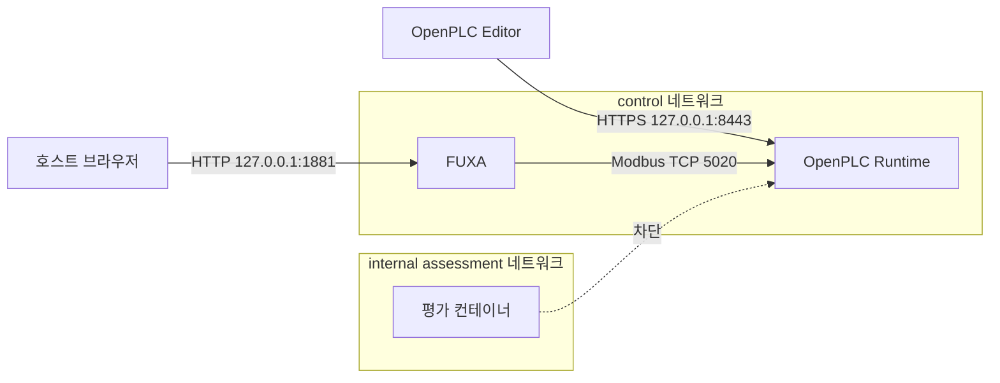

# ICS Security Assessment Lab — 최종 기술 보고서

평가 기간: 2026-09-17–2026-09-19 (Asia/Seoul)

대상: 소유한 Docker 기반 OpenPLC·FUXA 가상 탱크 실습 환경

결론: 접근 경계 발견사항 1건을 재현하고 네트워크 분리로 완화한 뒤, 차단과 정상 운영 유지를 함께 재검증함

## 1. 요약

OpenPLC Runtime v4와 FUXA로 탱크 수위·펌프 제어 환경을 구성하고 Modbus TCP 정상 통신을 기준선으로 확보했다. 정지 상태와 운전 중 패킷에서 요청·응답, Unit ID, 기능코드, 주소, 값과 공정 상태 변화를 연결했다.

정상 HMI가 아닌 임시 평가 컨테이너를 같은 Docker 제어망에 연결했을 때 별도 애플리케이션 자격증명 없이 펌프 명령을 쓸 수 있었다. 명령 ON, 펌프 가동, 수위 상승과 OFF 복원을 확인했다. 원인은 OpenPLC, FUXA와 평가 도구가 하나의 평면 네트워크를 공유하여 TCP 5020 도달 가능성이 사실상 권한 경계가 된 구성이었다.

평가 도구를 별도 내부 `assessment` 네트워크로 이동하고 OpenPLC·FUXA는 기존 `control` 네트워크에 유지했다. 동일 평가 도구는 첫 읽기 전에 이름 확인 단계에서 차단됐고, FUXA에서는 ON·OFF 제어와 값 갱신이 계속 동작했다. 발견사항 AC-01은 이 실습의 신뢰 모델에서 **높음**으로 평가했으며, 상태는 **완화 및 재검증 완료**다.

## 2. 범위와 제한

### 포함

- OpenPLC Runtime v4 계열 1대와 IEC 61131-3 Structured Text 제어 프로그램
- FUXA HMI 1대와 MainView 1개
- Modbus TCP 서버 `openplc:5020`, Unit ID 1
- 가상 태그 4개: 수위, 펌프 명령, 펌프 상태, 고수위 경보
- Docker Compose 네트워크의 정상 HMI 역할과 임시 평가자 역할
- 정상 패킷, 제한된 명령 쓰기, 네트워크 분리, 동일 조건 재검증

### 제외

- 실제 PLC, 물리 공정, 인터넷 또는 제3자 자산
- 서비스 거부, 대량·반복 쓰기, 지속성, 우회, CVE exploit
- 제품 자체의 취약성 판정, IEC 62443 준수 인증, 실제 안전·인명 영향 산정
- FUXA 침해 이후의 행위와 Docker 호스트 관리자에 대한 방어

이 결과는 의도적으로 단순화한 실습 환경에만 적용한다. 이미지가 `latest` 태그를 사용하며 정확한 digest를 고정하지 않은 점도 재현성 한계다.

## 3. 구성과 신뢰 경계

| 자산 | 역할 | 관찰한 인터페이스 |
| --- | --- | --- |
| OpenPLC Runtime | PLC 로직 실행과 Modbus 서버 | 관리면 `127.0.0.1:8443`, 내부 Modbus `5020` |
| FUXA | 태그 조회·표시와 펌프 명령 | 화면 `127.0.0.1:1881`, PLC 주소 `openplc:5020` |
| 평가 컨테이너 | 허용되지 않은 일반 Modbus client 역할 | 개선 전 `control`, 개선 후 `assessment` |
| 캡처 서비스 | OpenPLC network namespace에서 수동 캡처 | TCP 5020 PCAP 출력 |

관리면은 loopback에만 게시했고 Modbus 5020은 호스트에 게시하지 않았다. 최종 정책은 FUXA와 PLC의 공유망, 평가 도구의 별도 내부망이다.

## 4. 공정과 태그 대응

| 태그 | PLC 변수 | FUXA 표시 | Wire 주소 | 형식·권한 |
| --- | --- | --- | --- | --- |
| `tank_level` | `%QW0` | `400001` | Holding Register 0 | Int16, 읽기 |
| `pump_command` | `%QX0.0` | Coil 1 | Coil 0 | Bool, 읽기/쓰기 |
| `pump_running` | `%QX0.1` | Coil 2 | Coil 1 | Bool, 읽기 |
| `high_level_alarm` | `%QX0.2` | Coil 3 | Coil 2 | Bool, 읽기 |

펌프 명령이 ON이고 경보가 없으면 수위가 매초 1씩 증가한다. 펌프가 정지하면 매초 1씩 감소한다. 수위 80 이상에서는 경보가 활성화되고 펌프 상태가 정지한다. 이 로직은 실제 유체 공정이나 안전계장시스템을 재현하지 않는다.

## 5. 방법

1. 범위, 태그, 중단 조건과 증거 기준을 먼저 정의했다.
2. PLC 업로드, Modbus 읽기·쓰기, FUXA 태그와 화면 동작을 순차 확인했다.
3. 정지 상태와 ON·OFF 운전 상태를 별도 PCAP으로 확보했다.
4. 임시 평가자 역할에서 한 번의 제한된 펌프 명령을 시험하고 `finally` 절에서 OFF 복원을 수행했다.
5. 관찰 결과, 원인, 위험과 한계를 Finding으로 분리했다.
6. 평가자 네트워크만 분리하고 동일 도구로 차단을 재검증했다.
7. 차단 후 FUXA 정상 동작을 확인하여 가용성 회귀 여부를 점검했다.

예상하지 못한 값, HMI 갱신 중단, 반복 timeout 또는 서비스 재시작이 발생하면 중단하고 명령을 OFF로 복원하도록 정했다.

## 6. 정상 기준선

### 정지 상태

13.011초 동안 TCP 5020 프레임 80개를 캡처했다. 완전한 Modbus TCP ADU 54개는 요청 27개와 응답 27개로 구성됐으며 모든 거래 ID와 기능코드가 짝을 이뤘다. FC03 14쌍은 Holding Register 0을, FC01 13쌍은 Coil 0부터 3개를 읽었다. 값은 모두 0이었고 예외 응답은 없었다.

근거: [`fuxa-openplc-pcap-2026-09-18.md`](../evidence/baseline/fuxa-openplc-pcap-2026-09-18.md)

### ON·OFF 운전

58초 동안 프레임 360개, 완전한 ADU 240개를 분석했다. 요청·응답은 각각 120개였고 짝 불일치와 예외 응답은 없었다. FC05는 Coil 0에 `0xFF00`을 써서 ON, `0x0000`을 써서 OFF를 요청했으며 PLC가 각각 동일 주소와 값을 응답했다. Coil 응답은 `0x00 → 0x03 → 0x00`, 수위 응답은 `0 → 6 → 0`으로 변했다.

근거: [`fuxa-openplc-operation-2026-09-18.md`](../evidence/baseline/fuxa-openplc-operation-2026-09-18.md)

### 화면과 복원

FUXA에서 수위·명령·상태와 80% 경보 반응을 확인했다. FUXA 컨테이너 재시작 후 저장된 MainView와 동작이 복원됐다. 화면 증거가 보여 주는 상태와 사용자 관찰에 의존하는 전환을 각 기록에서 구분했다.

근거: [`fuxa-mainview-2026-09-18.md`](../evidence/baseline/fuxa-mainview-2026-09-18.md), [`fuxa-high-level-alarm-2026-09-18.md`](../evidence/baseline/fuxa-high-level-alarm-2026-09-18.md), [`fuxa-restart-recovery-2026-09-19.md`](../evidence/baseline/fuxa-restart-recovery-2026-09-19.md)

## 7. 발견사항 AC-01

**제목:** 제어망 내부의 제한 없는 Modbus 명령 접근

**등급:** 이 실습의 신뢰 모델에서 높음

**영향 자산:** OpenPLC Modbus 서버와 가상 펌프 공정

같은 `control` 네트워크에 연결한 평가 컨테이너가 FUXA 세션이나 PLC 자격증명 없이 초기 상태를 읽고 펌프 명령을 ON으로 변경했다. 시험 중 `pump_command=true`, `pump_running=true`, 수위 3을 관찰했다. 자동 복원 후 명령과 상태가 false로 돌아왔고 오류와 복원 오류는 없었다.

네트워크 접근이 선행 조건이지만, 접근한 client는 추가 권한 확인 없이 공정 명령을 변경할 수 있다. 실제 설비의 물리 피해를 검증하지 않았으므로 영향은 이 가상 공정의 명령·상태 변화로 제한해 설명한다.

근거: [`ac-02-unauthenticated-write-2026-09-19.md`](../evidence/assessment/ac-02-unauthenticated-write-2026-09-19.md), [`finding-ac-01.md`](finding-ac-01.md)

## 8. 개선

- `openplc`와 `fuxa`: 기존 `control` 네트워크 유지
- `modbus-probe`와 `modbus-pump-check`: 별도 `internal` `assessment` 네트워크로 이동
- 두 네트워크를 동시에 연결하는 일반 서비스 없음
- Modbus TCP 5020의 호스트 게시 없음
- OpenPLC와 FUXA를 재생성하지 않고 임시 평가자 경로만 변경

이 조치는 Docker 네트워크 연결을 client allowlist처럼 사용한다. Modbus 기능코드별 필터링, endpoint 인증 또는 암호화를 추가한 것은 아니다.

근거: [`network-remediation.md`](../docs/network-remediation.md), [`compose.yaml`](../lab/compose/compose.yaml)

## 9. 재검증

동일 `modbus-pump-check`를 격리된 평가망에서 다시 실행했다. 도구는 첫 baseline 읽기에서 `[Errno -3] Try again`으로 실패했으며 Modbus 읽기·쓰기 단계에 도달하지 못했다. 이후 FUXA에서 값 갱신과 ON·OFF 동작을 확인했고, 시험 후 화면은 명령 OFF와 수위 12%를 보였다.

| 재검증 조건 | 결과 |
| --- | --- |
| 평가자 읽기·쓰기 차단 | PASS — 첫 읽기 전 이름 확인/연결 단계에서 실패 |
| PLC 서비스 유지 | PASS — OpenPLC를 재생성하거나 중지하지 않음 |
| 허용된 FUXA 동작 유지 | 사용자 관찰 PASS — 값 갱신과 ON·OFF 동작 확인 |
| 종료 상태 복원 | PASS — 화면에서 명령 OFF 확인 |

근거: [`ac-01-network-separation-2026-09-19.md`](../evidence/retest/ac-01-network-separation-2026-09-19.md)

## 10. 잔여 위험과 후속 작업

- `control` 네트워크에 의도적으로 연결된 client는 여전히 Modbus 서비스에 접근할 수 있다.
- FUXA backend가 침해되면 신뢰된 경로를 이용한 명령을 막지 못한다.
- 일반 Modbus TCP payload는 허용된 제어망에서 평문으로 관찰된다.
- Docker 호스트 관리자는 이 네트워크 통제의 신뢰 경계 안에 있다.
- Runtime과 FUXA 이미지 digest가 고정되지 않아 장기 재현성이 제한된다.
- HMI LED에 눈에 보이는 명칭을 추가하여 운전자 해석의 모호성을 줄여야 한다.

후속 우선순위는 이미지 digest 고정, 새 PC에서 전체 복원 시험, HMI 명칭 개선이다. 제품이 지원하고 운영 요구가 맞는 경우 protocol-aware 정책이나 인증된 보안 전송을 별도 방어 계층으로 검토한다.

## 11. 최종 판정

이 프로젝트는 범위 설정, PLC/HMI 구축, 정상 패킷 해석, 제한된 접근통제 검증, 원인과 위험 설명, 네트워크 개선, 동일 경로 차단과 정상 운영 유지 재검증까지 연결했다. 결과는 실제 생산환경의 안전성이나 표준 준수를 증명하지 않지만, OT 보안 진단에서 필요한 증거 중심 판단과 변경 후 운영 검증 과정을 재현한다.
